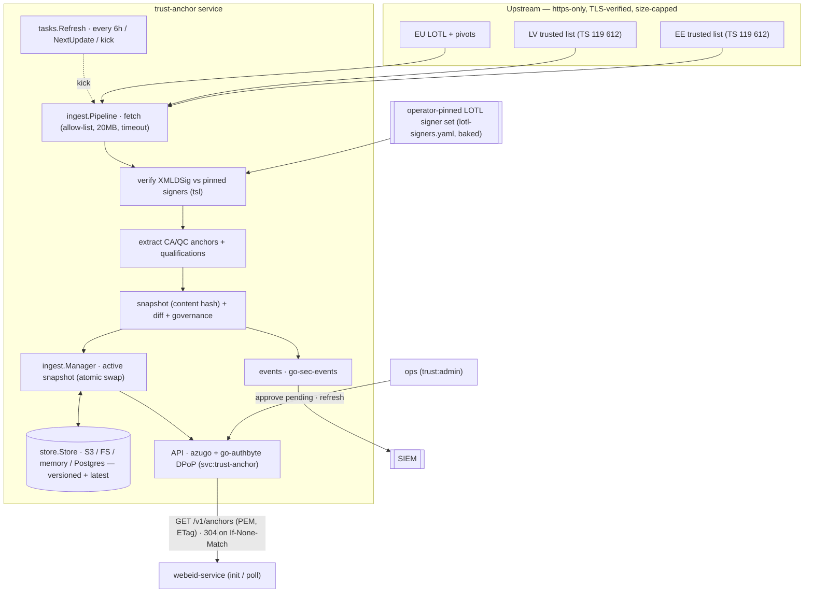

# trust-anchor

EU **LOTL/TL ingester → trusted-CA bundles**. The service automates the
trust-anchor lifecycle for the eSignature Portal:

> LOTL → pivot chain → national trusted lists (ETSI TS 119 612) → filtered
> CA/QC certificates → versioned, cacheable PEM bundles over an authenticated
> API — with every anchor-set change observable as a security event.

First consumer: the **webeid-service** (`WEBEID_TRUSTED_CA_CERTS_PATH`
file contract). Later: eparaksts-signer validation, Audit & Evidence, preservation.

---

## Architecture



**Trust model.** Trusted-list signatures are verified against *pinned*
expected signer certificates, never via chain building: the LOTL against the
operator-pinned OJEU bootstrap set plus accumulated pivot rotations; each
national TL against the signer certificates carried in its (verified) LOTL
pointer. Only signature-verified bytes are ever parsed for trust decisions.
The one unacceptable failure mode is serving unverified anchors; serving
slightly old data is fine (fail-safe: last good snapshot + security event).

Store backends (`store.Store`): **S3** (platform default), **fs**/**memory**
(dev/test), and **postgres** (dual-mode scaled / multi-DC — set
`TRUST_STORE_DSN`; the `trust_anchor` schema reached via SECURITY DEFINER
procedures, migration in `authbyte-db/trust-anchor/`; see DECISIONS D3/D15 and
`TRUST-INFRASTRUCTURE-EVOLUTION-SPEC.md`).

Package map: [`tsl/`](tsl) TS 119 612 parsing + XMLDSig verification ·
[`trust/`](trust) domain (anchors, snapshots, diff, filters, overlay, internal source) ·
[`ingest/`](ingest) fetcher/pipeline/pivots/manager ·
[`store/`](store) S3 / fs / memory / postgres snapshot stores · [`tasks/`](tasks)
refresh job · [`routes/`](routes) API. XMLDSig verification uses
`lafriks/go-xmldsig/v2`. Key design notes in [DECISIONS.md](DECISIONS.md) —
read D1 (XMLDSig adaptations) and D2 (pivot algorithm) before touching
`tsl/`.

## API

Audience `svc:trust-anchor`; DPoP-bound service tokens (go-authbyte). Scopes:
`trust:read` (bundles), `trust:admin` (governance). This is the `AUTH_MODE=dpop`
(default) picture; see [Auth modes](#auth-modes) below for the
`AUTH_MODE=internal` alternative — the scopes and routes are identical either
way, only how a request earns them differs.

| Method | Path | Scope | Purpose |
|---|---|---|---|
| GET | `/v1/anchors?territory=LV,EE&use=signature&qscdOnly=true&type=pid_provider` | trust:read | PEM bundle (`application/x-pem-file`). Strong `ETag` = snapshot id, honors `If-None-Match` → 304. Headers `X-Trust-Snapshot`, `X-Trust-Stale`. `type=` is additive (see [Internal trust source](#internal-trust-source--operator-declared-eudi-anchors)); omitted ⇒ legacy untyped anchors only |
| GET | `/v1/anchors.json` (same filters) | trust:read | base64-DER certs + TSP/service metadata, qualifications, fingerprints, plus `type`/`useCases`/`tlSequence` when set |
| GET | `/v1/snapshot` | trust:read | snapshot summary + diff vs previous + pending set + `advertisedOj` + active bootstrap summary (`ojReference`, fingerprints) + `overlayCount`/`internalCount` |
| POST | `/v1/pending/{fingerprint}/approve` | trust:admin | approve a held addition (hold mode) |
| POST | `/v1/refresh` | trust:admin | run an immediate ingestion cycle (also re-reads `INTERNAL_TRUST_SOURCE`) |
| GET | `/healthz`, `/readyz` | none | readiness = a valid snapshot is loaded |

`use=` ∈ `signature | authentication | seal | website`, mapped from the
`Fore*` qualifiers; a service with no `Fore*` qualifier is included in **all**
uses (TS 119 612 default, task §5). `authentication` is an alias of
`signature` at anchor level (eID authentication certs chain to the same
CA/QC services; see DECISIONS D4). `qscdOnly` maps from `QCWithQSCD` — note
the current LV list carries it only on historical entries (D4).

## Consumer recipe — webeid-service

go-web-eid keeps its file contract (`loadTrustedCAs`: PEM file or dir). The
webeid-service wrapper or an init container does:

```sh
# init: fetch the LV signature anchors into the trust dir
curl -H "Authorization: Bearer $TOKEN" -H "DPoP: $PROOF" \
     -o /etc/webeid/trust/lv-anchors.pem \
     "https://trust-anchor:8080/v1/anchors?territory=LV&use=signature"
# (+ use=authentication separately if a split is wanted — identical today)
export WEBEID_TRUSTED_CA_CERTS_PATH=/etc/webeid/trust/
```

Poll on an interval with `If-None-Match: "<last ETag>"`:

* `304` — nothing to do.
* `200` — write the new bundle, then rebuild the handler / trigger a rolling
  restart (go-web-eid loads the file at startup).
* On errors keep the existing file — the service applies the same fail-safe
  upstream. Treat `X-Trust-Stale: true` as a monitoring signal, not an error.

Demo/test CAs (e.g. `DEMO LV eID ICA 2021/2024`, never present in production
TLs) are deployed to the trust-anchor service via `TRUST_EXTRA_ANCHORS_PATH`
and arrive in the same bundle tagged `source: manual-overlay`.

## Internal trust source — operator-declared EUDI anchors

The EU has not yet published machine-readable trust lists for the new EUDI
actor types (PID providers, wallet providers, Access CAs, WRPRC issuers,
(Q)EAA providers, status-list signers) — the eventual source is **ETSI TS 119
602 LoTE** (JSON-as-signed-JWT), not expected before ~2027. Meanwhile an
operator running a real private trust ecosystem (its own Wallet CA, Access CA,
status signers) can declare those anchors directly, so the whole consuming
fleet (e.g. the EUDI verifier's `go-eudi-trust`/trust-cache-worker) resolves
them through the same API, snapshots, ETags, staleness and events as
TL-sourced anchors — see `DECISIONS.md` D17.

Set `INTERNAL_TRUST_SOURCE=<path>/internal-trust.yaml` (unset = feature off,
zero behavior change). A worked, fully-commented example lives at
[`examples/internal-trust.yaml`](examples/internal-trust.yaml). Shape:

```yaml
anchors:
  - name: "Operator PID Issuer CA"
    type: pid_provider          # required; one of the 11-value taxonomy (trust.AnchorTypes); unknown => whole file rejected
    territory: LV                # required; ISO 3166-1 alpha-2, or "EU"
    status: granted               # optional; defaults to the TS 119 612 "granted" status URI
    certificate: |                 # exactly one of: certificate (inline PEM) | certificateFile (path, relative to this file)
      -----BEGIN CERTIFICATE-----
      ...
      -----END CERTIFICATE-----
    validUntil: 2027-12-31T00:00:00Z  # optional; capped to min(declared, certificate NotAfter) — never extends it
    useCases: []                       # optional; (Q)EAA/PubEAA provider types only
```

Trust posture and failure handling (`trust.LoadInternal`):

- **Same posture as `LOTL_BOOTSTRAP_CERTS_PATH`, not a TL entry** — every
  declared certificate is trusted directly, with no signature chain behind it.
  The file itself is the security boundary: treat it like key material
  (ownership, review, change control). Entries activate immediately and
  bypass hold mode — deploying the file IS the operator's approval.
- **Fail-closed at whole-file granularity.** Any invalid entry (unknown
  `type`, bad `territory`, wrong number of certificate sources, unparseable
  or expired certificate, duplicate fingerprint across entries) rejects the
  entire file for that cycle. Errors name the offending entry by name and
  fingerprint — **never file contents**; a top-level YAML parse error is a
  deliberately static `"malformed YAML"` message for the same reason.
  Non-first-run failures carry the previous internal set over (a
  `trust.internal_source_error` event fires); on the very first run (no prior
  snapshot at all) a bad file simply yields zero internal anchors rather than
  blocking the service from ever producing a first snapshot.
- **Re-read on every refresh cycle** (the 6h timer or an admin
  `POST /v1/refresh`) — there is no file-watcher. Edit the file, then kick a
  refresh; a changed set produces a new snapshot ID so ETag-polling consumers
  pick it up.

Querying: the additive `type=` filter on `GET /v1/anchors(.json)` is how
consumers read these back — `?type=pid_provider` (combinable with
`territory=`) returns only that type, from any source (internal, overlay, or
territory); the untyped/legacy `/v1/anchors` view is unaffected and never
includes typed anchors. `GET /v1/snapshot` reports `internalCount` alongside
`overlayCount`.

```sh
curl -H "Authorization: Bearer $TOKEN" -H "DPoP: $PROOF" \
     "https://trust-anchor:8080/v1/anchors.json?type=pid_provider&territory=LV"
```

## Auth modes

`AUTH_MODE` selects the `/v1` inbound authentication strategy; routes and
scope enforcement (`trust:read` / `trust:admin`) are identical either way —
only how a request earns a scope differs.

- **`AUTH_MODE=dpop`** (default) — exactly today's behavior: go-authbyte
  DPoP-bound service tokens, audience `svc:trust-anchor`, validated per the
  [API](#api) section above. Byte-identical; no config beyond `AUTH_ISSUER_URL`
  / `SERVICE_AUDIENCE` / the standard `DPOP_*` vars.
- **`AUTH_MODE=internal`** — for co-located, network-trusted deployments
  (same namespace / encrypted overlay), where a full DPoP issuer is
  unnecessary ceremony:
  - **Read endpoints** (`/v1/anchors`, `/v1/anchors.json`, `/v1/snapshot`)
    are anonymous — every request is granted `trust:read`.
  - **Admin endpoints** (`/v1/refresh`, `/v1/pending/{fp}/approve`)
    additionally require a header
    `X-API-Key: $TRUST_ADMIN_KEY`, compared constant-time
    (`crypto/subtle.ConstantTimeCompare`). A missing or wrong key is denied
    through the **same `requireScope` → 403 path** used for an ordinary scope
    denial today (`authz.denied` event) — a caller cannot distinguish "no
    key" from "wrong key" from the response (no oracle; bodies are identical
    modulo the per-request `trace_id`).
  - **Boot fails closed**: `AUTH_MODE=internal` with an empty
    `TRUST_ADMIN_KEY` refuses to start. No DPoP environment variable is
    needed at all in this mode (`AUTH_ISSUER_URL`/`SERVICE_AUDIENCE` are
    ignored).
  - `TRUST_ADMIN_KEY` is a secret: required, never logged, never echoed in
    error messages.

```sh
# internal mode: reads are anonymous
curl "https://trust-anchor:8080/v1/anchors.json?type=access_ca"
# admin endpoints need the key
curl -X POST -H "X-API-Key: $TRUST_ADMIN_KEY" "https://trust-anchor:8080/v1/refresh"
```

The EUDI verifier's trust-cache-worker sync client needs no code change for
this — its own `internal` auth mode already sends unauthenticated requests;
the fleet-side delta is two environment values on the worker (the service URL
and dropping its cold-start-allowed flag).

## Configuration

| Env | Default | Purpose |
|---|---|---|
| `LOTL_URL` | `https://ec.europa.eu/tools/lotl/eu-lotl.xml` | EU List of Trusted Lists |
| `LOTL_BOOTSTRAP_CERTS_PATH` | baked `/etc/trust-anchor/lotl-signers.yaml` | OJEU-published LOTL signer set — the operator-pinned **first-install seed** (a `lotl-signers.yaml` manifest, which also carries its own OJ reference, or a PEM/DER file/dir). The image bakes a default, so a normal deploy needs no trust config; afterwards the persisted store is authoritative and the path is ignored |
| `TRUST_TERRITORIES` | `LV,EE` | national lists to ingest |
| `TRUST_ACCEPTED_STATUSES` | `granted` | accepted service statuses (names or full URIs) |
| `TRUST_REFRESH_INTERVAL` | `6h` | refresh cadence (earliest TL `NextUpdate` is honored too) |
| `TRUST_ACTIVATION_MODE` | `auto` | `auto` \| `hold` (additions held for approval) |
| `TRUST_HOLD_AUTO_RELEASE` | `72h` | hold-mode auto-release window |
| `TRUST_STALE_GRACE` | `24h` | grace past `NextUpdate` before data is flagged stale |
| `TRUST_EXTRA_ANCHORS_PATH` | — | demo/test overlay (PEM file/dir); empty in production |
| `INTERNAL_TRUST_SOURCE` | — | operator-declared anchor file (YAML): typed EUDI anchors (`pid_provider`, `qeaa_provider`, …) with no upstream TL/XMLDSig chain. Parsed fail-closed (`trust.LoadInternal`) — any invalid entry rejects the WHOLE file, and a bad edit carries the previous internal set over rather than adopting a partial one. Bypasses hold mode, like the overlay |
| `TRUST_SNAPSHOT_BUCKET/ENDPOINT/ACCESS_KEY/SECRET_KEY/PREFIX/USE_SSL` | — | S3-API snapshot store (platform standard) |
| `TRUST_SNAPSHOT_DIR` | — | filesystem store (development) |
| `TRUST_STORE_DSN` | — | **PostgreSQL backend** — the dual-mode scaled / multi-DC store (spec P1b): the `trust_anchor` schema reached via `SECURITY DEFINER` procedures. **Takes precedence** over S3/FS/memory when set. Schema migration in `authbyte-db/trust-anchor/`; connect as the EXECUTE-only `trust_anchor_public` role and source the DSN from Vault (it carries a password). |
| `TRUST_FETCH_TIMEOUT` / `MAX_TL_BYTES` | `30s` / `20MiB` | fetch guards |
| `AUTH_MODE` | `dpop` | `dpop` (go-authbyte DPoP validation, below) \| `internal` — co-located, network-trusted deployments: every request gets `trust:read`; `trust:admin` additionally on a matching `X-API-Key` (constant-time compare against `TRUST_ADMIN_KEY`). Routes and scope enforcement are identical in both modes |
| `AUTH_ISSUER_URL` / `SERVICE_AUDIENCE` | — / `svc:trust-anchor` | go-authbyte inbound validation (plus standard `DPOP_*` vars); consulted only when `AUTH_MODE=dpop` |
| `TRUST_ADMIN_KEY` | — | `AUTH_MODE=internal` only: the `X-API-Key` value that grants `trust:admin`. **Secret** — required (boot fails closed if empty), never logged |

Egress: exactly the LOTL host and the TL hosts discovered from the verified
LOTL — https only, TLS verified, size-capped. Any non-https pointer raises
`egress.violation` and the territory falls back to its last good data.

## Registry additions (authbyte-core/registry.yaml)

```yaml
# audience: svc:trust-anchor
# scopes:   trust:read  — bundle consumers
#           trust:admin — ops tooling only
- client_id: svc:web-eid
  grants:
    - audience: svc:trust-anchor
      scopes: [trust:read]
# later: svc:eparaksts-signer (validation), svc:audit-evidence → trust:read
- client_id: svc:ops-tools          # ops/dpo tooling client
  grants:
    - audience: svc:trust-anchor
      scopes: [trust:read, trust:admin]
```

## LOTL signer set (bootstrap) — pinning + rotation

The LOTL signer certificates published in the EU Official Journal are the root
of the whole trust tree. They are **operator-pinned**, never fetched at
runtime: the published OJ notice (eur-lex/CELLAR) is not reliably reachable for
automation, so the service depends on no such fetch. The set is a
`lotl-signers.yaml` manifest managed under [`trust-config/`](trust-config)
(certs + a generator + provenance notes); the image bakes it and defaults
`LOTL_BOOTSTRAP_CERTS_PATH` to it.

**First install.** Nothing to configure — the baked manifest seeds bootstrap
**v1** on first start (empty store), which is then persisted and authoritative.
To pin a different set, mount a manifest (or PEM/DER file/dir) and point
`LOTL_BOOTSTRAP_CERTS_PATH` at it; a manifest carries its own `oj_reference`,
so nothing else need be set.

**Rotation** — expected only every few years; the pivot chain rotates signers
automatically in between (verified against the current set), so the pinned root
changes rarely. The snapshot's `advertisedOj` (from `GET /v1/snapshot`) is the
signal: when it names an OJ reference newer than the pinned set, a fresh signer
set has been published. To adopt it:

1. Obtain the new signer certificates from the current OJ notice and confirm
   each SHA-256 against the DSS oj-certificates service — see
   [`trust-config/README.md`](trust-config/README.md).
2. Update `trust-config/` (drop the PEMs in, regenerate `lotl-signers.yaml`,
   review, commit) and rebuild the image — or mount the updated manifest for an
   urgent change ahead of a rebuild.
3. The persisted store is authoritative after first install, so the updated
   manifest re-seeds only against an empty bootstrap store: redeploy with the
   bootstrap store cleared so the new set persists as the current **v1**.

## Ops runbook

* **`trust.anchor_change` (high)** — a CA was added/removed in a bundle.
  Removals are upstream-authoritative and applied immediately. For additions
  in `hold` mode: review `GET /v1/snapshot` → `pending`, verify the TSP/
  service against the national TL operator's publication, then
  `POST /v1/pending/{fingerprint}/approve`. Unapproved additions auto-release
  after `TRUST_HOLD_AUTO_RELEASE`.
  *Severity vs log level:* "(high)" is the event's **administrative
  importance**, not a log error. Because these carry `outcome=success`, they
  are logged at **warn** (metadata-only changes at **info**) — `error` is
  reserved for `outcome=failure`/`denied` events. So a first ingest adding
  many anchors produces warns, not a wall of red.
* **`trust.refresh_failure` (warning)** — a cycle failed; the last good
  snapshot is still served. Investigate upstream availability; data ages
  toward staleness, nothing breaks immediately.
* **`trust.stale` / `X-Trust-Stale: true`** — data is past `NextUpdate` +
  grace. Persistent staleness means refresh has been failing: check egress,
  upstream status, and whether the LOTL/TL URLs moved.
* **`egress.violation` (high)** — a TL pointer was non-https or outside the
  allow-list. Possible upstream misconfiguration or tampering; the territory
  keeps serving last good data.
* **Readiness** — `/readyz` is 503 until a snapshot exists (store restore or
  first successful cycle). First install needs working egress.
* **Fixture refresh** (yearly, or when lists change shape): re-record
  `testdata/` — the current LOTL + pivots + LV/EE TLs — and update the
  expected counts/fingerprints in `trust/extract_test.go` and
  `ingest/pipeline_test.go` (sequences asserted in `tsl/verify_test.go`).
  Verify against live first: `go test -tags live ./ingest/ -run TestLiveRefresh -v`.

## Development

```sh
go build ./...
go vet ./...
go test -race -count=1 ./...          # fixtures only — hermetic
go test -tags live ./ingest/ -v       # live network (manual)

# local run without S3 (the image bakes lotl-signers.yaml; override the path to
# use your own manifest/PEM):
TRUST_SNAPSHOT_DIR=./.snapshots \
LOTL_BOOTSTRAP_CERTS_PATH=./trust-config/lotl-signers.yaml \
AUTH_ISSUER_URL=http://localhost:8080 SERVICE_AUDIENCE=svc:trust-anchor \
go run ./cmd/server web
```

Docker build context is **this module directory** (no local `replace`s — the
`gmb-sig/*` deps are fetched from the network at their tags): from `trust-anchor/`,
`docker build -t trust-anchor:dev .`. In the local stack it's built + run via
[`sign-portal/docker-compose.yml`](../docker-compose.yml) (see `RUN-LOCAL.md`),
where first-install seeds the bootstrap from `LOTL_BOOTSTRAP_CERTS_PATH` (the
baked `lotl-signers.yaml` by default).
