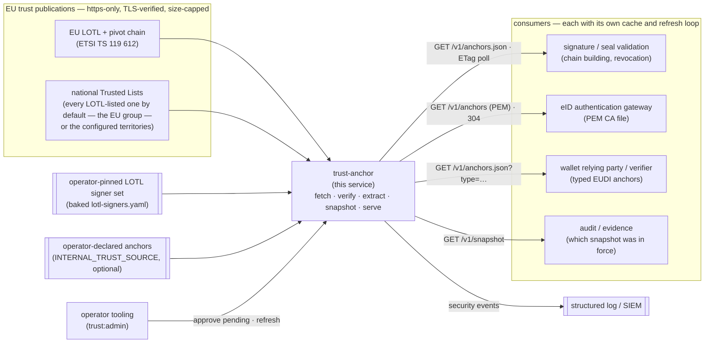
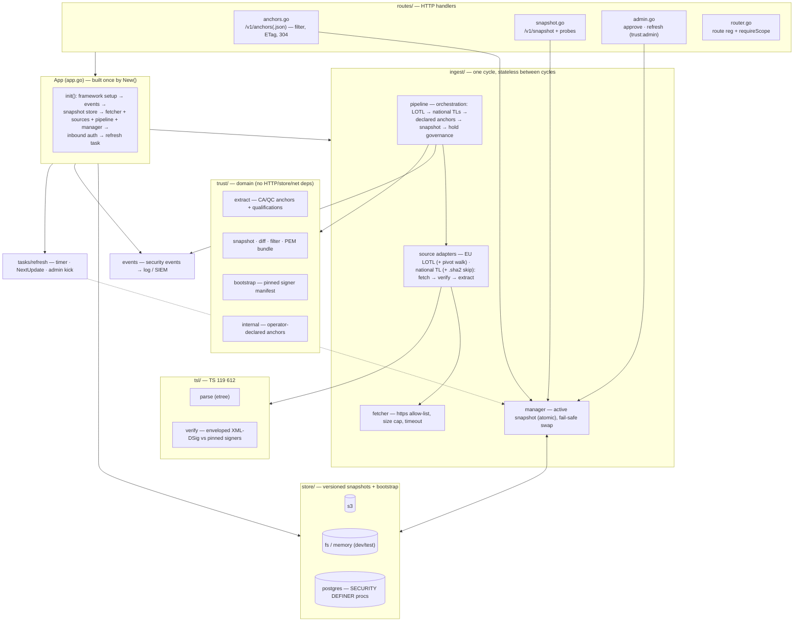
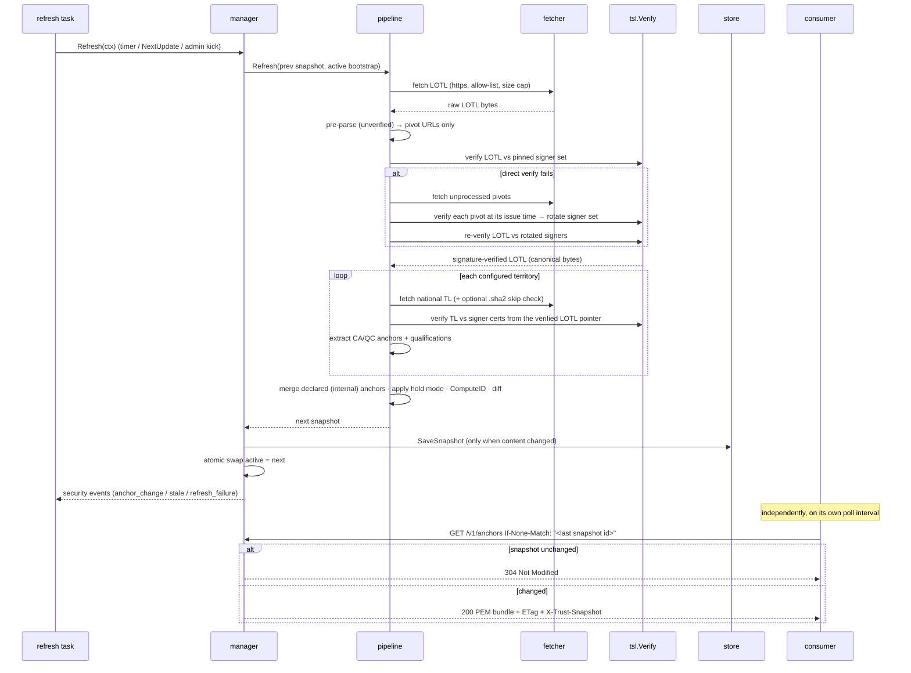

# trust-anchor

An **EU trusted-list ingester**. It fetches the EU **List of Trusted Lists (LOTL)** and the national **Trusted Lists** it points to (ETSI TS 119 612), verifies every list's XML signature against a pinned signer set, extracts the qualified CA certificates, and serves them as versioned, cacheable **trust bundles** over an authenticated HTTP API. It answers one question — *which certificate authorities does the EU currently trust, signature-verified* — and answers it the same way for every consumer. It is an operational realisation of the eIDAS trust framework (Regulation (EU) No 910/2014, in particular the Article 22 trusted-list obligation and its implementing acts).

Its job is deliberately narrow. It turns a chain of externally published, XML-DSig-signed documents into a small, deterministic **trust snapshot** — a content-addressed set of trusted CA anchors plus the metadata consumers filter on (territory, use, QSCD qualification, and an additive EUDI anchor type) — and it hands that snapshot out. It does **not** validate end-entity certificates, run OCSP/CRL revocation, or make per-signature trust decisions: those belong to the consuming services.

**Who consumes it.** Anything that must know which CAs the EU trusts without parsing and verifying trusted lists itself: a signature- or seal-validation service building certificate chains, an eID authentication gateway that needs a CA file for card certificates, a wallet relying party (an EUDI verifier) resolving issuer and wallet-provider trust, an audit or evidence store recording which trust set was in force. Every consumer keeps its **own local cache** and refreshes it over the HTTP API — the service shares no filesystem and no database with anyone. The one unacceptable failure mode is serving **unverified** anchors; serving *slightly old* verified anchors is by design fine (fail-safe: keep the last good snapshot and raise a security event).

It renders no human UI. It is written in Go on the [Azugo](https://azugo.io) web framework; structured logging, tracing, metrics and log redaction come from [go-platform-kit](https://github.com/gmb-lib/go-platform-kit), security events from [go-sec-events](https://github.com/gmb-lib/go-sec-events), inbound DPoP token validation from [go-authbyte](https://github.com/gmb-lib/go-authbyte), and XML-DSig verification from [go-xmldsig](https://github.com/lafriks/go-xmldsig). All are public Go modules fetched at their tags.

The standards and legal acts cited here and in the source — with the exact editions the claims were checked against — are pinned in [`SPECREFS.md`](SPECREFS.md). Changes per release are in [`CHANGELOG.md`](CHANGELOG.md).

---

## Where it sits

trust-anchor is the boundary between the EU's published trust lists and every service that needs to know which CAs to trust. It reaches upstream only over TLS, only to the LOTL host and the national-TL hosts it discovers *inside the verified LOTL*, size-capped and allow-listed. Downstream, each consumer owns its refresh loop and its own cache.



Division of labour: trust-anchor owns the *upstream* half — fetching, XML-DSig verification against pinned signers, anchor extraction, snapshot versioning and change governance — and serves an immutable, ETag-identified snapshot. Each consumer owns the *downstream* half — its own poll cadence, its own cache, and every per-certificate decision (chain building, revocation, signature verification) it makes with the anchors. The two meet only at the authenticated HTTP bundle endpoint and its `ETag` / `If-None-Match` contract; there is no shared state between them.

---

## Running it

The container image is published at **`ghcr.io/go-make-bytes/trust-anchor`** — `vX.Y.Z` tags for GitHub Releases, `latest` for the `main` branch, `develop`, and `sha-<short>` per commit. Every image is built once, given an SBOM, scanned for HIGH/CRITICAL vulnerabilities, signed with cosign (keyless, GitHub OIDC) and only then pushed; a release tag is a retag of the already-signed digest, never a rebuild. The image is `scratch`-based and starts `/server web` on port 8080 with the pinned LOTL signer set baked in, so a first run needs no trust configuration at all.

The smallest useful deployment — one node, a filesystem snapshot store, the network-trusted auth mode:

```sh
mkdir -p trust-anchor-data
docker run --rm -p 8080:8080 --user "$(id -u):$(id -g)" \
  -e SERVICE_NAME=trust-anchor \
  -e AUTH_MODE=internal -e TRUST_ADMIN_KEY=change-me \
  -e TRUST_SNAPSHOT_DIR=/var/lib/trust-anchor -v "$PWD/trust-anchor-data:/var/lib/trust-anchor" \
  -e TRUST_TERRITORIES=EU \
  ghcr.io/go-make-bytes/trust-anchor:latest
# TRUST_TERRITORIES=EU is the default (every list the LOTL points to); narrow with codes, e.g. LV,EE

curl -s localhost:8080/readyz                       # 503 until the first cycle completes (about a minute for the EU group), then 200
curl -s localhost:8080/v1/snapshot | head -c 400    # the served snapshot, per-territory outcomes
curl -s "localhost:8080/v1/anchors?use=signature" -o eu-signature-cas.pem
```

Two things the command carries on purpose. `SERVICE_NAME` is required by the base configuration — the process refuses to start without it. And the image runs as an unprivileged user (uid 1000), so the snapshot directory must be writable by whoever the container runs as: the `--user` flag above makes that the invoking user of a bind-mounted directory. With a named volume instead, initialise its ownership once (`docker run --rm -v trust-anchor-data:/data alpine chown 1000:1000 /data`) — a fresh volume is created root-owned, and the service then fails at start with `mkdir …/bootstrap: permission denied`.

For anything shared or multi-instance: an S3-compatible bucket or Postgres as the snapshot store, `AUTH_MODE=dpop` in front of an OAuth 2.0 issuer, and the security events wired to your log pipeline — all below.

---

## HTTP surface

Two anonymous probes plus a token-guarded `/v1` API. Every `/v1` route enforces a `trust:<level>` scope; the routes and scope checks are identical regardless of the inbound auth mode (see [Auth modes](#auth-modes)) — only *how a request earns a scope* differs.

| Method + path | Scope | Purpose |
|---|---|---|
| `GET /healthz` | none | Liveness — 200 whenever the process is up |
| `GET /readyz` | none | Readiness — 503 until a valid snapshot is loaded (store restore or first successful cycle), then 200 |
| `GET /v1/anchors` | `trust:read` | Filtered **PEM bundle** (`application/x-pem-file`). Strong `ETag` = snapshot id; honours `If-None-Match` (returns 304). Exposes `X-Trust-Snapshot` and `X-Trust-Stale` headers |
| `GET /v1/anchors.json` | `trust:read` | Same filters — base64-DER certificates plus TSP/service metadata, qualifications, fingerprints, the key named as `keyAlgorithm` / `curve` (`rsa` · `rsassa-pss` · `ecdsa` + `P-256` … `brainpoolP256r1` … · `ed25519`), and `type` / `useCases` / `tlSequence` where set |
| `GET /v1/snapshot` | `trust:read` | Snapshot summary + diff vs the previous snapshot + pending set + `advertisedOj` + active bootstrap summary (`ojReference`, fingerprints) + `internalCount`. Per territory: `anchorCount`; `heldCount` — anchors in the snapshot that the default bundle leaves out because their key is not one every consumer parses (served with `keys=all`); and the services the list declares that became no anchor at all — `skippedCount` plus a `skipped` list naming each (provider, service, `reason`, fingerprint, and the key algorithm / curve when readable) |
| `POST /v1/pending/{fingerprint}/approve` | `trust:admin` | Approve a held addition (hold activation mode) |
| `POST /v1/refresh` | `trust:admin` | Re-read the operator-declared source (applied even when the trusted-list upstream is unreachable), then run an immediate ingestion cycle. Answers `200` with a per-half report — the declared outcome and the cycle outcome stated separately, and `snapshot` always the id being served. `502` only when nothing has ever been served and the cycle failed |

**Bundle filters** (shared by both `/v1/anchors*` routes, all optional):

- `territory=DE,FR` — comma-separated ISO 3166-1 alpha-2 codes; default all.
- `use=signature | authentication | seal | website` — mapped from the service's `AdditionalServiceInformation` URIs (`ForeSignatures` / `ForeSeals` / `ForWebSiteAuthentication`, [ETSI TS 119 612 V2.4.1 §5.5.9.4]); a service with no such qualifier is included in **all** uses (the TS 119 612 default). `authentication` is served as an alias of `signature` (eID authentication certificates chain to the same CA/QC services, and TS 119 612 defines no distinct authentication qualifier). `website` maps the QWAC qualifier.
- `qscdOnly=true` — restrict to `QCWithQSCD`-qualified services.
- `type=<eudi-anchor-type>` — **additive** filter selecting a typed EUDI anchor (see [The internal trust source](#the-internal-trust-source--operator-declared-eudi-anchors)); omitted means legacy untyped CA/QC anchors only. Unknown values are rejected (fail closed).
- `keys=common | all` — which public keys the bundle may contain. **`common` (the default)** serves only anchors whose key every mainstream X.509 stack parses: RSA (including keys identified as RSASSA-PSS), ECDSA on the NIST P-curves, Ed25519. **`all`** adds the **held** anchors — trusted-list services whose certificate is fine but whose key is on another curve (the **Brainpool** family German providers use), which this service stores and describes without interpreting the key. The default exists because a consumer whose certificate parser refuses one key typically rejects the whole bundle; ask for `all` only from a consumer that either parses those keys or tolerates the ones it cannot. The rule is by key identifiers, not by any one parser's behaviour. Unknown values are rejected.

An unknown `use`, `type` or `keys` value returns a 422 validation error; a request before the first snapshot exists returns 503.

---

## Architecture

`New()` (in [`app.go`](app.go)) wires every dependency once and **fails closed** on misconfiguration: an internal auth mode with no admin key, an invalid DPoP config, or an unreachable Postgres store stops the process from starting. Only signature-verified bytes are ever parsed for a trust decision — the pipeline pre-parses unverified input for pivot URLs only, then discards it.



Package map: [`tsl/`](tsl) TS 119 612 parsing + enveloped XML-DSig verification · [`trust/`](trust) the domain model (anchors, snapshots, diff, filters, internal source, bootstrap) · [`source/`](source) the per-source-type adapter contract (fetch → verify → extract; one adapter per kind of list) · [`ingest/`](ingest) the fetcher, the two list adapters in use (EU LOTL including the pivot walk; national TLs including the `.sha2` change-detection), pipeline orchestration, active-snapshot manager · [`store/`](store) S3 / filesystem / memory / Postgres snapshot stores · [`tasks/`](tasks) the refresh loop · [`routes/`](routes) the HTTP API · [`events/`](events) security-event emission.

### Ingest → verify → snapshot → serve

One cycle, from an upstream fetch to a consumer's 304. The manager holds the active snapshot behind an atomic pointer; a failed cycle never replaces the last good one.



---

## Trust model and bootstrap

Trusted-list signatures are verified against **pinned expected signer certificates — never via chain building.** `tsl.Verify` requires the signature's `KeyInfo` certificate to be byte-identical to one of the pinned signers and within its validity window, digest-checks every `SignedInfo` reference (including the XAdES `SignedProperties` reference), and returns the exclusive-C14N canonical bytes the signature actually covered. Downstream parsing consumes *only* those verified bytes, so nothing unsigned ever reaches a trust decision (X.509 per RFC 5280; XML-DSig per the W3C recommendation as profiled by TS 119 612).

The signer set is layered:

- The **LOTL** is verified against the operator-pinned signer set (the OJEU-published bootstrap), plus any pivot rotations accumulated in the previous snapshot.
- Each **national TL** is verified against the signer certificates carried in its *pointer inside the already-verified LOTL* — so national trust descends from the LOTL root, never from an independent fetch.
- **Pivots**: when the LOTL no longer verifies against the current signer set, the pipeline walks the LOTL pivot chain (each pivot is itself a signed LOTL-shaped document), verifying each pivot at *its own* issue time and rotating to the signer set it advertises, until the current LOTL verifies again. The rotated set is persisted on the snapshot so a restart never re-walks the chain.

**Bootstrap seeding.** The OJEU-published LOTL signer certificates are the root of the whole tree. They are **operator-pinned, never fetched at runtime** — a `lotl-signers.yaml` manifest (certificates plus the Official Journal reference they were published under and their SHA-256 fingerprints) maintained under [`trust-config/`](trust-config), baked into the container image at `/etc/trust-anchor/lotl-signers.yaml`. On first install (empty store), the baked manifest seeds bootstrap **version 1**, which is then persisted and becomes authoritative; afterwards `LOTL_BOOTSTRAP_CERTS_PATH` is ignored. A normal deploy needs no trust configuration. Manifest parsing is fail-closed: malformed YAML, a missing certificate, or an entry that does not hold exactly one certificate rejects the whole set (a partial or ambiguous bootstrap is never returned), and error text never echoes file contents.

**Rotation** is expected only every few years (the pivot chain handles interim signer rotations automatically). The snapshot's `advertisedOj` field is the signal: when it names an Official Journal reference newer than the pinned set, a fresh signer set has been published. Adopting it means updating `trust-config/` (drop the new PEMs in, regenerate the manifest, confirm each SHA-256 against the EU DSS oj-certificates service, rebuild the image) or mounting an updated manifest for an urgent change — see [`trust-config/README.md`](trust-config/README.md). `advertisedOj` drives no automatic trust decision; the trusted signer set is always the operator-pinned one.

**Fail-safe, not fail-open.** A total cycle failure keeps the last good snapshot active and raises `trust.refresh_failure`. Every territory is an independent upstream and is treated as one: a per-territory failure carries that territory's previous data over (marked `carriedOver`), and a territory with **no** previous data (a fresh install, or a newly configured territory) is recorded in the snapshot as a **failed entry** (`failed` + `failureReason`, zero anchors) while the rest of the cycle completes — one broken national list never suppresses the twenty-six healthy ones, and a broken territory is visible instead of silently absent. The floor stays loud: the LOTL failing, or *every* configured territory failing with nothing to carry over, fails the whole cycle. Data past its `NextUpdate` + grace is still served, flagged `X-Trust-Stale: true` and reported via `trust.stale` — staleness is a monitoring signal, not an error. A failed entry contributes nothing to the snapshot id (health is a process outcome, not trust content), so consumer ETags move only when trust actually changes. The same honesty applies one level down. An accepted service whose certificate the parser refuses **only because of its public key** (a curve the standard library does not implement) still becomes an anchor: the certificate body is read structurally — subject, validity, key algorithm and curve, the raw bytes and their fingerprint — and the anchor is **held**: in the snapshot, in `keys=all` bundles, counted as `heldCount`, but outside the default bundle so no consumer receives a key it cannot parse. An accepted service whose certificate cannot become an anchor at all — a malformed certificate, an identity with no certificate, a status conflict — is **skipped as data**, not silently: the territory's `skipped` list names it, the `trust_services_skipped` gauge counts it, and the inventory line records it, while the territory stays healthy and the snapshot id (like `failed`) does not move for it.

### The internal trust source — operator-declared EUDI anchors

The EU has not yet published machine-readable trust lists for the newer EUDI actor types (PID providers, wallet providers, Access CAs, WRPRC issuers, (Q)EAA providers, status-list signers). Until it does, an operator running a real private trust ecosystem can declare those anchors directly via `INTERNAL_TRUST_SOURCE` (a YAML file; unset = feature off, zero behaviour change). Every consumer then resolves them through the same API, snapshots, ETags, staleness and events as TL-sourced anchors, and reads them back through the additive `type=` filter. The closed type vocabulary is `pid_provider` · `qeaa_provider` · `pub_eaa_provider` · `eaa_provider` · `wallet_provider` · `access_ca` · `wrprc_issuer` and the four `*_status` signer types (`pid_provider_status`, `qeaa_provider_status`, `pub_eaa_provider_status`, `eaa_provider_status`). A worked example lives at [`examples/internal-trust.yaml`](examples/internal-trust.yaml).

Trust posture: an internal anchor carries the **same posture as the pinned bootstrap** — each declared certificate is trusted directly, with no signature chain behind it. The file *is* the security boundary; treat it as key material (ownership, review, change control). Entries activate immediately and bypass hold mode — deploying the file is the operator's approval. Loading is **fail-closed at whole-file granularity**: any invalid entry (unknown type, bad territory, wrong number of certificate sources, unparseable or expired certificate, duplicate fingerprint) rejects the entire file for that cycle, naming the offending entry by name and fingerprint — never by file contents. A bad edit after the first run carries the previous internal set over and raises `trust.internal_source_error`. The file is re-read **at boot** (the restored snapshot is reconciled against the file as it is now) and **on every refresh cycle** — and both work with the trusted-list upstream unreachable, which is exactly when a declared CA is most urgently needed. There is no file-watcher, so the operating habit is: **edit → `POST /v1/refresh` (or restart) → confirm the snapshot id changed** (`GET /v1/snapshot`). The refresh response reports the declared half explicitly (`declared.changed`, plus `carriedOver` + `error` when the load failed), so an upstream outage can never mask what happened to the declared set. One gotcha worth knowing: change detection is fingerprint-based, so a **metadata-only edit** (an entry's `name` or `territory` label) is silently a no-op — served `serviceName` comes from the certificate subject, not the declaration; to change what is served, add or remove a certificate. The parser is fuzzed and must never panic on malformed input.

### Hold mode and change governance

`TRUST_ACTIVATION_MODE=hold` moves anchor **additions** into a pending set (visible via `/v1/snapshot`, excluded from bundles) until an operator approves them with `POST /v1/pending/{fingerprint}/approve` or `TRUST_HOLD_AUTO_RELEASE` elapses. **Removals always apply immediately** — a withdrawn or suspended CA must not stay trusted. Declared (internal) anchors are operator-deployed and bypass hold — deploying the file is the approval, deliberately (the operator who can place the declaration is already trusted to place it; a second in-band approval by the same person would be ceremony, not control). Every anchor-set change emits a `trust.anchor_change` event; the first ever ingest is treated as the baseline, not a flood of held additions.

---

## State and data model

trust-anchor persists exactly two kinds of object, each versioned with a "latest" pointer: the **trust snapshot** (content-addressed by its `id`) and the **bootstrap** signer set. The active snapshot is held in memory behind an atomic pointer and re-read from the store on restart. There is intentionally no per-anchor relational schema — the dataset is tens of certificates plus metadata.

The store backend is derived from configuration:

| Backend | Selected by | Use |
|---|---|---|
| **postgres** | `TRUST_STORE_DSN` set (takes precedence) | Scaled / multi-instance deployments. Pool size comes from the DSN itself — `pool_max_conns` (pgx reads it and strips it before Postgres sees it; its default is the host's CPU count): set it explicitly to the deployment's connection budget, e.g. `?sslmode=…&pool_max_conns=4&pool_min_conns=1`. |
| **s3** | `TRUST_SNAPSHOT_BUCKET` set | Any S3-compatible object storage |
| **fs** | `TRUST_SNAPSHOT_DIR` set | Single-node deployments and local development |
| **memory** | none of the above | Tests only — snapshots do not survive a restart |

The **Postgres** backend never touches tables directly. It reaches a dedicated `trust_anchor` schema **only** through four `SECURITY DEFINER` procedures — `trust_anchor.save_snapshot`, `load_latest_snapshot`, `save_bootstrap`, `load_latest_bootstrap` — each with the uniform signature `(pi_data jsonb, INOUT po_data jsonb)`: the marshalled snapshot or bootstrap goes in as `pi_data` and is stored verbatim (key columns are projected from it), and a structured success-or-error envelope comes back. The service connects as an **`EXECUTE`-only role** (`trust_anchor_public`) that holds no table privileges, so a bug or injection cannot read or write rows outside the procedure contract. A procedure that fails after a write re-raises a structured error to force a rollback, which the store decodes back into the same typed error shape as the validation path. The service does **not** create the schema: a reference implementation — Flyway migrations for the two versioned tables, the four procedures, the role grants, and the small `util` schema they use for the result envelope — is published in the [signbyte-database](https://github.com/signbyte/signbyte-database/tree/HEAD/migrations/trust_anchor) repository and can be applied as-is or ported to your own migration tooling. The DSN carries a password, so it is sourced from a mounted secret (see `TRUST_STORE_DSN_FILE` below), never an inline literal.

trust-anchor keeps **no cache layer of its own** (no Redis/Valkey) — caching is the consumer's responsibility. Its contribution to that model is the stable `ETag` (= snapshot id) that lets every consumer poll cheaply and refresh only on real change.

---

## Auth modes

`AUTH_MODE` selects the `/v1` inbound authentication strategy; the routes and the `trust:read` / `trust:admin` scope checks are identical in both modes.

- **`AUTH_MODE=dpop`** (default) — every `/v1` request carries an OAuth 2.0 access token sender-constrained with a DPoP proof ([IETF RFC 9449]). The token is validated by the go-authbyte client against the issuer named in `AUTH_ISSUER_URL` (signature via the issuer's JWKS, audience `SERVICE_AUDIENCE`, DPoP proof binding, nonce and replay checks), and the `trust:read` / `trust:admin` scopes are read from it. Grant `trust:read` to bundle consumers and `trust:admin` to operator tooling only. Configuration:

  | Env var | Default | Meaning |
  |---|---|---|
  | `AUTH_ISSUER_URL` | — | The OAuth 2.0 / OpenID issuer that mints the access tokens (required in this mode) |
  | `SERVICE_AUDIENCE` | — | The audience a token must carry to be accepted here; `svc:trust-anchor` by convention (required) |
  | `AUTH_JWKS_URL` | derived from the issuer | Override of the JWKS location |
  | `AUTH_JWKS_CACHE_TTL` | `10m` | How long fetched signing keys are cached; an unknown `kid` triggers a refetch regardless |
  | `DPOP_PROOF_MAX_AGE` | `60s` | Maximum age of a DPoP proof's `iat` |
  | `DPOP_NONCE_ENABLED` / `DPOP_NONCE_TTL` | `true` / `5m` | Server-provided DPoP nonces and their lifetime |
  | `DPOP_REPLAY_BACKEND` | `memory` | Where seen DPoP proof ids are remembered for replay detection: `memory` (single instance) or `redis` (shared across instances) |

- **`AUTH_MODE=internal`** — for co-located, network-trusted deployments (same namespace / encrypted overlay) where a full token issuer is unnecessary. Read endpoints are anonymous (every request is granted `trust:read`); admin endpoints additionally require a header `X-API-Key: $TRUST_ADMIN_KEY`, compared in constant time. A missing or wrong key is denied through the *same* scope-denial path as any other 403 (identical response body modulo the per-request trace id — no oracle). Boot **fails closed**: `AUTH_MODE=internal` with an empty `TRUST_ADMIN_KEY` refuses to start, and no DPoP configuration is consulted at all in this mode. The admin key is a secret — required, never logged, never echoed in an error.

```sh
# dpop (default): a bundle consumer polls with a DPoP-bound token
curl -H "Authorization: DPoP $TOKEN" -H "DPoP: $PROOF" \
     "https://trust-anchor.example:8080/v1/anchors?territory=EU&use=signature"

# internal: reads are anonymous; admin needs the key
curl "https://trust-anchor.example:8080/v1/anchors.json?type=access_ca"
curl -X POST -H "X-API-Key: $TRUST_ADMIN_KEY" "https://trust-anchor.example:8080/v1/refresh"
```

A refresh answers with both halves of what it did — the declared reconcile and the upstream cycle
— and `snapshot` is always the id being served as it answers:

```json
{
  "snapshot": "7c25d7ad…",
  "changed": true,
  "declared": { "changed": true },
  "cycle": { "ok": true, "territories": { "ok": 30, "failed": ["PT"] } }
}
```

With the upstream unreachable, `declared` still reports truthfully (`cycle.ok` goes `false` with
the error; `territories` is omitted — a failed cycle produced no per-territory outcomes).

---

## Consuming a bundle

A consumer keeps its own cache and refreshes over the API on an interval, using the strong `ETag` to avoid re-downloading unchanged data. The simplest consumer is anything that reads CA certificates from a PEM file or directory — most TLS stacks, eID authentication libraries and signature validators do:

```sh
# initial fetch of the signature-use anchors for two territories into the consumer's trust directory
curl -H "Authorization: DPoP $TOKEN" -H "DPoP: $PROOF" \
     -o /etc/myservice/trust/eu-anchors.pem \
     "https://trust-anchor.example:8080/v1/anchors?territory=DE,FR&use=signature"
```

Then poll with `If-None-Match: "<last ETag>"`: a `304` means nothing to do; a `200` means write the new bundle and reload the consumer. On any error, keep the existing file — the consumer applies the same fail-safe the service does upstream, and treats `X-Trust-Stale: true` as a monitoring signal, not an error. Demo/test CAs that never appear in production TLs are declared in the `INTERNAL_TRUST_SOURCE` file as entries without a `type:` (or with the explicit `tsl_ca` alias) and arrive in the same untyped bundle tagged `source: internal`. Typed EUDI anchors are read back with the `type=` filter, e.g. `?type=pid_provider&territory=EU`.

The default bundle contains only anchors whose key your certificate parser will accept (`keys=common`). If your validator can verify Brainpool-curve chains — or skips certificates it cannot parse instead of rejecting the file — ask for `keys=all` and you also receive the held anchors (on the German list today, the twelve CA/QC services keyed on brainpoolP256r1); `GET /v1/snapshot` says how many each territory holds (`heldCount`). A consumer that rejects a bundle on the first unparseable certificate must stay on the default.

---

## Configuration

Server, logging, metrics and tracing settings are the framework's base configuration — `SERVER_URLS`, `ENVIRONMENT`, `SERVICE_NAME` (required), `LOG_LEVEL` / `LOG_FORMAT`, `METRICS_ENABLED` / `METRICS_PATH` / `METRICS_TRUSTED_IPS`, `OTEL_EXPORTER_OTLP_ENDPOINT` and the other standard `OTEL_*` variables. The service's own settings:

| Env var | Default | Meaning |
|---|---|---|
| `LOTL_URL` | `https://ec.europa.eu/tools/lotl/eu-lotl.xml` | EU List of Trusted Lists location |
| `LOTL_BOOTSTRAP_CERTS_PATH` | baked `/etc/trust-anchor/lotl-signers.yaml` | Operator-pinned LOTL signer set — the first-install seed (a `lotl-signers.yaml` manifest carrying its own OJ reference, or a PEM/DER file/dir). The image bakes a default; after first install the persisted store is authoritative and this path is ignored |
| `TRUST_TERRITORIES` | `EU` | National lists to ingest: comma-separated territory codes, plus the group `EU` — which expands, per cycle, to every territory the **verified LOTL** publishes an XML pointer for (the member states — Greece under its publisher code `EL` — plus the EEA countries and UK today; membership changes flow in on the LOTL's own clock). Explicit codes combine with the group and de-duplicate (`EU,LV` = `EU`). A code the LOTL has no pointer for (e.g. `UA`) is served as a named `failed` territory entry, not dropped — configured intent is never silently narrowed. The default is the whole `EU` group; list explicit codes to narrow |
| `TRUST_ALLOW_HTTP_TERRITORIES` | *(empty)* | Territories whose trusted list may be fetched over its published plain-http pointer (e.g. `SK`). Default empty = https required. Integrity comes from the XMLDSig verification against the LOTL-pinned signers, never from transport; this waives only the defense-in-depth https rule, per named territory, with a loud log line per cycle. Never applies to the LOTL itself |
| `TRUST_ACCEPTED_STATUSES` | `granted` | Accepted service statuses (short names or full TS 119 612 URIs) |
| `TRUST_REFRESH_INTERVAL` | `6h` | Refresh cadence; the earliest TL `NextUpdate` is honoured too |
| `TRUST_ACTIVATION_MODE` | `auto` | `auto` \| `hold` (additions held for operator approval) |
| `TRUST_HOLD_AUTO_RELEASE` | `72h` | Hold-mode auto-release window |
| `TRUST_STALE_GRACE` | `24h` | Grace past `NextUpdate` before data is flagged stale |
| `TRUST_SERVICE_TYPES` | `CA/QC` | Accepted trusted-list service types (comma-separated registered Svctype URIs or shorthand suffixes). Services of other types are counted and reported, never silently dropped. Each accepted type must have a serving route (a bundle the anchors can be requested through) or boot fails. National-level types are matched against the national status vocabulary (`recognisedatnationallevel` for `granted`, `deprecatedatnationallevel` for `withdrawn`) — the qualified and national planes never share status values |
| `INTERNAL_TRUST_SOURCE` | — | The operator declaration file (YAML): typed EUDI actor anchors AND untyped CA declarations (no `type:`, or the `tsl_ca` alias). Parsed fail-closed at whole-file granularity; a bad edit carries the previous set over (`trust.internal_source_error`). Bypasses hold mode — deploying the file is the approval |
| `TRUST_EXTRA_ANCHORS_PATH` | **retired** | The manual overlay is gone. A deployment still setting this fails boot with a migration pointer — refusing to start beats silently not serving anchors the operator expects. Declare the same certificates in `INTERNAL_TRUST_SOURCE` instead |
| `TRUST_SNAPSHOT_BUCKET` / `_ENDPOINT` / `_ACCESS_KEY` / `_SECRET_KEY` / `_PREFIX` / `_USE_SSL` | — / — / — / — / — / `true` | S3-compatible snapshot store; `_ENDPOINT` is required when a bucket is set |
| `TRUST_SNAPSHOT_DIR` | — | Filesystem snapshot store (single node / development) |
| `TRUST_STORE_DSN` | — | PostgreSQL backend DSN — reached via `SECURITY DEFINER` procedures as the `EXECUTE`-only `trust_anchor_public` role. **Takes precedence** over S3/FS/memory. Secret: supports the `TRUST_STORE_DSN_FILE` convention (a mounted file; an explicit plain value still overrides it) |
| `TRUST_FETCH_TIMEOUT` | `30s` | Per-fetch timeout |
| `MAX_TL_BYTES` | `20MiB` | Response size cap on any trusted-list fetch |
| `AUTH_MODE` | `dpop` | `dpop` \| `internal` (see [Auth modes](#auth-modes)) |
| `AUTH_ISSUER_URL` / `SERVICE_AUDIENCE` / `AUTH_JWKS_*` / `DPOP_*` | see [Auth modes](#auth-modes) | Inbound token validation; consulted only when `AUTH_MODE=dpop` |
| `TRUST_ADMIN_KEY` | — | `AUTH_MODE=internal` only: the `X-API-Key` value that grants `trust:admin`. **Secret** — required (boot fails closed if empty), never logged. Supports the `TRUST_ADMIN_KEY_FILE` convention |

Upstream egress is confined to exactly the LOTL host and the TL hosts discovered from the *verified* LOTL — https only, TLS verified, size-capped. Any non-https pointer raises `egress.violation` and that territory falls back to its last good data (or a failed entry when it has none). One narrow, explicit exception: a territory named in `TRUST_ALLOW_HTTP_TERRITORIES` may be fetched over its published plain-http pointer (Slovakia's LOTL pointer is http, and its https alternative serves a wrong-hostname certificate). List **integrity never rests on transport** — every fetched list is XMLDSig-verified against the LOTL-pinned signers before anything trusts it — so the opt-in waives only the defense-in-depth transport rule, per named territory, logged loudly on every cycle. It can never apply to the LOTL itself.

---

## Observability and security events

Cross-cutting observability (structured logging, OpenTelemetry tracing, metrics) is installed by the go-platform-kit library; upstream fetches run through an instrumented HTTP transport so LOTL and national-TL requests appear as client spans. The service's operationally meaningful signals split three ways, each in the medium that fits it: **freshness and volume are metrics** (the alerting layer — see below), **identity is the API** (`GET /v1/snapshot` names the served snapshot; the snapshot id is deliberately never a metric label, because ids churn a new time series per value), and **transitions and detail are structured log events** — security events emitted through go-sec-events into the structured log stream your SIEM or log pipeline consumes (background-task emissions, which have no request context, are written to the service log in the same shape), plus the trust-inventory line described after them.

### Metrics

Registered on the process-wide registry the HTTP server exposes at `/metrics` (`METRICS_PATH`) on
the same port — answered only to callers listed in `METRICS_TRUSTED_IPS` (default `127.0.0.1`;
semicolon-separated IPs or CIDRs, `*` for any), so on the box itself `curl localhost:8080/metrics`
works during an incident, while a scraper on another host needs its address listed. All label
values are low-cardinality by construction (source tags, territory codes, the closed anchor-type
taxonomy).

| Metric | Type | Meaning |
|---|---|---|
| `trust_snapshot_age_seconds` | gauge (computed at scrape) | Age of the served snapshot. `-1` means nothing is served yet |
| `trust_sync_last_success_timestamp_seconds` | gauge | Unix time of the last successful refresh cycle. `0` until the first success — `time() - value` alerting catches both "never" and "stopped" |
| `trust_anchors_total{source,territory,type}` | gauge | Served anchors per source (`tl` / `internal`), territory and anchor type (empty type = CA/QC plane). A series whose anchors vanish from the served snapshot drops to 0, never lingers at its old value |
| `trust_declared_source_failed{source}` | gauge 0/1 | `1` while the last load of the operator-declared source (`internal`) failed and the previous set is carried over. Deliberately a metric, not a health flip: carried-over data is stale but healthy, and a degraded readiness would invite an orchestrator to restart a service that is serving fine |
| `trust_territory_failed{territory}` | gauge 0/1 | `1` while the territory is served as a failed entry (its list could not be ingested and no previous data exists — zero anchors for it). The alerting answer to silent degradation: a wide territory set quietly shrinking to a few healthy lists is visible without diffing snapshots. Same posture as the declared gauge — never a health flip |
| `trust_services_skipped{territory,reason}` | gauge | Accepted trust services of a *healthy* territory whose certificate did not become an anchor — the narrowing `trust_territory_failed` cannot see. `reason` is a closed set: `invalid-certificate` (undecodable or malformed — a legacy encoding defect, a broken base64 value; a certificate whose key is merely unsupported is **held**, not skipped), `no-certificate` (identity without an X509Certificate element), `status-conflict` (one certificate listed under conflicting statuses — dropped fail-closed). Drops to 0 when the skips vanish. The named entries are on `GET /v1/snapshot` |

### Security events

| Event | Severity | When |
|---|---|---|
| `trust.anchor_change` | warning (add/remove), info (metadata) | A CA was added, removed, or changed in a bundle. Noteworthy and worth a human looking, but the successful outcome of a refresh — so a first ingest adding many anchors is not a wall of errors |
| `trust.pending_approved` | warning | A held addition was approved (via API or auto-release) |
| `trust.refresh_failure` | warning | A cycle (or a persistence step) failed; the last good snapshot is still served |
| `trust.stale` | warning | Served data is past `NextUpdate` + grace |
| `trust.internal_source_error` | warning | `INTERNAL_TRUST_SOURCE` failed to load/validate; the previous internal set is carried over |
| `egress.violation` | high | A TL pointer was non-https or outside the allow-list; the territory keeps serving last good data |
| `authz.denied` | warning | A `/v1` request lacked the required `trust:<level>` scope |

### The trust-inventory log line

One structured `trust inventory` line is written at startup and on any change to the declared
set, under the rule **declared trust is named, derived trust is counted**: every operator-declared
anchor is listed in full — `name`, `type`, `territory`, `status`,
`sha256`, `validUntil` — because a declaration exists in one file on one disk and the log is its
only other record; trusted-list anchors appear as per-territory and per-type counts, because each
one is in a published, signed, re-fetchable list. A **skipped** trusted-list service is named too
(`skipped_count`, and `skipped_services` with `territory`, `name`, `service`, `reason`, `sha256`,
`keyAlgorithm`, `curve`): it is an anchor the list declares and the bundle does not carry, and
nothing else in the served data records that absence. Subjects and fingerprints are non-sensitive
provenance; certificate material never appears.

Each declared source carries a state field that keeps three outcomes apart which look identical
from outside:

| `internal_state` | Meaning |
|---|---|
| `not_configured` | The source path is unset — the feature is off |
| `ok` | The file loaded; `*_count` says how many anchors it declared (0 is a valid answer) |
| `carried_over` | **The trap.** The file failed to load and the previous set is still being served — from outside this reads exactly like a successful edit. `*_error` says why |

### Logs to monitor

The table above is the catalogue; this is the operating guidance. A trust service fails in a way
that looks like success — it keeps answering, with data that is old, incomplete, or carried over
from before an operator's edit. **Nothing here surfaces as an error to a caller**, so if these
events are not watched, the first symptom is an eID card that will not authenticate, or a
signature validated against a certificate authority that was withdrawn weeks ago.

Alert on these — each one means trust decisions are being made on data you would not choose:

| Event | Why it matters | What to do |
|---|---|---|
| `trust.stale` | Anchors are being served past the publisher's own `NextUpdate` plus grace. The data is not wrong yet; it is no longer vouched for. | Check upstream reachability and the last successful refresh. A stale that persists past one refresh interval is an outage of the source, not a blip. |
| `egress.violation` | A trusted-list pointer was non-HTTPS or outside the configured allow-list. Either the upstream list changed shape, or something is redirecting it. | Treat as potentially hostile until explained. The affected territory keeps serving its last good data, so there is time to look. |
| `trust.internal_source_error` | The operator declaration file failed to load or validate, and **the previous set is being served instead**. The edit that was just deployed is not live. | Read the diagnostic, which names the offending entry. Until it is fixed, what is served is the state before the edit — which looks identical to a successful edit from the outside. |
| `trust.refresh_failure` | A cycle failed; the last good snapshot is still served. | One is normal on a flaky network. A run of them means refreshes have silently stopped and staleness is next. |
| `trust_services_skipped{territory,reason}` > 0 (metric) | A healthy territory is serving **fewer anchors than its list declares**: a certificate authority the member state trusts is missing from the bundle, and a certificate chaining to it will fail validation here while the territory reports healthy. | Read the named entries on `GET /v1/snapshot` (`skipped`) or the `skipped_services` field of the inventory line. A *change* in the count is the signal to alert on. `invalid-certificate` on a granted service is worth reporting to the publisher. (An anchor missing from *your* bundle because its key is unsupported is not a skip — it is held; see `heldCount` and the `keys` filter.) |

Review, do not alert:

| Event | Why it matters |
|---|---|
| `trust.anchor_change` | The record of what changed and when — the first thing to read after any trust incident, and the only place a removed certificate authority is visible after the fact. Warning severity for add/remove, informational for metadata. |
| `trust.pending_approved` | A held addition became active, and whether a human or the auto-release did it. |
| `authz.denied` | Occasional entries are normal (a misconfigured client). A sustained pattern from one caller is worth understanding. |

Three operating notes that are easy to learn the hard way:

- **A first ingest emits many `trust.anchor_change` events at warning severity.** That is a populated
  bundle, not an incident. Alert on the *rate after steady state*, not on presence.
- **Background events carry no request correlation id**, because refresh cycles run outside any
  request. They are written to the service log in the same structured shape as request-scoped
  events, so they are searchable by event type — just not joinable to a caller.
- **Some trusted-list hosts are picky about the client.** At least one national list host returns
  403 to Go's default User-Agent while serving browsers fine, so the fetcher sends an identifying
  `trust-anchor/1.0 (EU trusted-list ingester; +https://github.com/go-make-bytes/trust-anchor)` User-Agent. And at least one LOTL pointer has used a plain `http://`
  location — the https-only egress rule correctly refuses such a territory unless it is named in
  `TRUST_ALLOW_HTTP_TERRITORIES`; that refusal is the guard working, not a bug.

If logs are collected with Loki, the whole stream for this service is:

```logql
{service_name="trust-anchor"} | json | event_type=~"trust\\..*|egress\\.violation|authz\\.denied"
```

---

## Directory layout

```
trust-anchor/
├── app.go, config.go            — App container + fail-closed configuration
├── testing.go                   — test harness helpers
├── cmd/server/                  — CLI entrypoint (web + health subcommands)
├── routes/                      — HTTP API
│   ├── router.go                — route registration + requireScope
│   ├── anchors.go               — /v1/anchors(.json): filter, ETag, 304, headers
│   ├── snapshot.go              — /v1/snapshot + healthz/readyz
│   ├── admin.go                 — approve pending · refresh (trust:admin)
│   └── response/                — API response DTOs
├── ingest/                      — one ingestion cycle
│   ├── fetcher.go               — https allow-list, size cap, timeout, .sha2 digest fetch
│   ├── source_lotl.go           — EU LOTL adapter (fetch → verify → pivot walk → extract pointers)
│   ├── source_national.go       — national TL adapter (.sha2 skip → fetch → verify → extract)
│   ├── pipeline.go              — orchestration: LOTL → national TLs → declared → snapshot → hold
│   ├── pivot.go                 — LOTL pivot-chain signer rotation
│   ├── manager.go               — active snapshot (atomic), fail-safe swap, approvals
│   ├── inventory.go             — the trust-inventory log line
│   └── oj.go                    — advertised OJ reference (observability signal)
├── source/                      — the per-source-type adapter contract (Source, RegistrySource)
├── tsl/                         — ETSI TS 119 612
│   ├── parse.go, types.go       — trusted-list parsing
│   └── verify.go                — enveloped XML-DSig vs pinned signers
├── trust/                       — domain model (no HTTP/store/net deps)
│   ├── anchor.go                — Anchor, Territory, Snapshot, Bootstrap, ComputeID
│   ├── extract.go               — CA/QC anchor extraction + qualifications
│   ├── filter.go                — bundle filtering + PEM assembly
│   ├── diff.go                  — anchor-set diff between snapshots
│   ├── bootstrap.go             — pinned signer manifest / PEM loading
│   └── internal.go              — operator-declared EUDI anchors (fail-closed)
├── store/                       — s3 / fs / memory / postgres snapshot stores
├── tasks/refresh.go             — refresh loop (interval · NextUpdate · admin kick)
├── events/                      — security-event emission
├── trust-config/                — pinned lotl-signers.yaml + generator + provenance
├── examples/internal-trust.yaml — worked internal-trust-source example
├── testdata/                    — recorded LOTL + pivots + national TLs (hermetic tests)
└── Dockerfile                   — scratch image; bakes lotl-signers.yaml
```

---

## Development

There is no build tag split — the production build and the test build share one dependency closure. Tests are hermetic (recorded fixtures under `testdata/`); live-network tests are behind the `live` build tag and run manually.

```sh
go build ./...                        # prod build — matches the Dockerfile build stage
go vet ./...
go test -race -count=1 ./...          # fixtures only — no network
go test -tags live ./ingest/ -v       # live network against the real LOTL/TLs (manual)

# Fuzz the one untrusted-input parser (INTERNAL_TRUST_SOURCE YAML) — must never panic:
go test ./trust -run '^$' -fuzz FuzzLoadInternal -fuzztime 30s

# Local run without object storage (the image bakes lotl-signers.yaml; override the
# path to use your own manifest/PEM):
SERVICE_NAME=trust-anchor \
TRUST_SNAPSHOT_DIR=./.snapshots \
LOTL_BOOTSTRAP_CERTS_PATH=./trust-config/lotl-signers.yaml \
AUTH_MODE=internal TRUST_ADMIN_KEY=dev-only \
go run ./cmd/server web
```

The Docker build context is this module directory; every dependency is fetched from its public module tag (no `replace` directives): `docker build -t trust-anchor:dev .`. First install seeds the bootstrap from the baked `lotl-signers.yaml`. The full gate CI runs — lint, vulnerability check, tidy check — is in [CONTRIBUTING.md](CONTRIBUTING.md).

When a list changes shape or yearly, refresh the fixtures under `testdata/` (the current LOTL + pivots + national TLs) and update the expected counts/fingerprints in the extraction and pipeline tests; verify against live first with the `live`-tagged refresh test.

---

## Security invariants

- **Only signature-verified bytes are trusted.** Unverified input is pre-parsed for pivot URLs only and discarded; every trust decision consumes the exclusive-C14N output of `tsl.Verify`.
- **Signer pinning, never chain building.** The XML-DSig `KeyInfo` certificate must be byte-identical to a pinned signer and within its validity window. The LOTL root set is operator-pinned; national trust descends only from the verified LOTL pointer.
- **Fail-safe, never fail-open.** A failed cycle keeps the last good snapshot and raises an event; a per-territory failure carries previous data over; the first cycle refuses to serve a partial snapshot. Serving stale-but-verified data is acceptable and flagged; serving unverified data is not.
- **Operator-approved bootstrap and internal anchors.** The pinned signer set and the internal trust source are trusted directly, with no chain behind them — the files are the security boundary, treated as key material; hold mode requires explicit approval for additions.
- **Egress is allow-listed.** Only https, only the LOTL host and TL hosts from the verified LOTL, size-capped; a non-https or off-list pointer is refused and reported.
- **Least privilege at the database.** The Postgres backend runs as an `EXECUTE`-only role and touches data only through `SECURITY DEFINER` procedures — no direct table access.
- **Secrets stay out of logs and errors.** The admin key and store DSN are secrets (mountable via the `*_FILE` convention); error messages naming a bad trust entry never embed file contents or key material, and the untrusted-input parser is fuzzed.
- **Fail-closed boot.** Invalid auth configuration, a missing admin key in internal mode, or an absent first-install bootstrap stops the process from starting.

---

## Conformance position (ETSI TS 119 615)

`[ETSI TS 119 615 V1.4.1]` defines the procedures a relying implementation applies when reading
EU trusted lists. This service implements the **authentication and extraction** half and was
read clause-by-clause against §4 (2026-08); the deliberate scope boundaries below are design,
not omissions — recorded here so they are not rediscovered as defects.

- **Per-certificate determinations are the validators' job.** EU qualified-certificate
  determination `[ETSI TS 119 615 V1.4.1 §4.4.4]`, QSCD determination `[ETSI TS 119 615 V1.4.1
  §4.5.4]` and token-issuer qualification `[ETSI TS 119 615 V1.4.1 §4.6.4]` need the end-entity
  certificate in hand (its `QcSSCD` statement, policy OIDs, issuer names). The per-anchor
  `qualifiers`, `qcWithQscd` and `uses` this service serves are **routing metadata for bundle
  filtering**, not a determination: trusted-list qualifiers formally apply to the end-entity
  certificates matched by each qualification element's criteria `[ETSI TS 119 612 V2.4.1
  §5.5.9.2.3]`, which only a validator holding the certificate can evaluate. Consumers making
  qualification decisions run the §4.4/§4.5 procedures themselves.
- **Service history is not extracted.** Bundles serve **current** trust; point-in-time status
  resolution (`Service history instance` selection, `[ETSI TS 119 615 V1.4.1 §4.3.4]`) belongs
  to signature validation. "Was this CA granted at signing time" cannot be answered from a
  bundle, by design.
- **The trust root does not rotate itself.** The standard permits automatic update of the OJEU
  location and LOTL signer set from list content (`[ETSI TS 119 615 V1.4.1 §4.1.4]`
  PRO-4.1.4-16/-17); here the root set is operator-pinned, the advertised OJ reference is
  surfaced for comparison, and a divergence raises an alert instead of a silent rotation —
  changing the trust root is a human decision.
- **National-TL staleness is a warning, not a failure** — the same posture the standard itself
  takes for TLs past `NextUpdate` (`[ETSI TS 119 615 V1.4.1 §4.2.4]` PRO-4.2.4-10). The
  configurable grace window and the fail-safe carry-over are documented extensions on top.
- **The LOTL, by contrast, hard-fails when expired** (`[ETSI TS 119 615 V1.4.1 §4.1.4]`
  PRO-4.1.4-13, `LOTL_NEXTUPDATE_PASSED`): a LOTL past its own `NextUpdate` no longer
  authenticates — the cycle fails and the previous snapshot stays served. The asymmetry with the
  national-TL warning above is the standard's own.
- **Signer self-consistency is enforced** (`[ETSI TS 119 615 V1.4.1 §4.1.4]` PRO-4.1.4-10(a) /
  PRO-4.1.4-11(g)): on direct verification the LOTL's signing certificate must be in the LOTL's
  own EU self-pointer set, and every processed pivot's signing certificate must be in that
  pivot's own set — publication-consistency checks on top of the pinned chain of trust. After a
  pivot walk the LOTL-level property holds by construction: the re-verification pins the LOTL's
  signer into the newest pivot's set, which is the standard's n>0 requirement.

---

## Known limitations

- **Anchors whose public key is outside RSA, the NIST P-curves and Ed25519 are held, not served by default.** The certificate parser this service (and every Go consumer) uses refuses elliptic-curve keys on other curves — in practice the **Brainpool** curves [RFC 5639] that German qualified providers use for their CA certificates: on the German list today twelve granted CA/QC services (D-Trust, Deutsche Telekom, DGN, medisign, Atos), and four Lithuanian qualified time-stamp services once `TRUST_SERVICE_TYPES` admits `TSA/QTST`. Such an anchor is **held**: read structurally (subject, validity, key algorithm and curve, raw bytes, fingerprint — the key itself is never interpreted), counted in `heldCount`, and served only to `keys=all`. The default bundle is therefore narrower than the list by exactly those anchors, on purpose: a consumer that rejects a bundle on the first certificate it cannot parse would otherwise fail at its next restart. A relying party that must validate against a Brainpool-keyed authority needs a validator that can, and asks for `keys=all`; this service never verifies chains itself. Anchors persisted by an earlier release carry no `keyAlgorithm` until the next refresh cycle and are treated as common meanwhile — correct by construction, since they were parsed to get there.
- **Only list-shaped sources are wired.** The `source/` contract anticipates several kinds of trust publication; today the EU LOTL and the national trusted lists go through it as adapters, while registry-shaped sources (relying-party registries) and further list types (wallet-provider, certified-wallet and QTSP lists) are contracts without implementations. The `.sha2` unchanged-skip is applied to national lists, not yet to the LOTL itself.
- **EUDI actor trust is operator-declared, not upstream.** Until the EU publishes machine-readable trust lists for the new EUDI actor types, typed anchors come only from `INTERNAL_TRUST_SOURCE` — a direct-trust file, not an XML-DSig-verified list.
- **No file-watcher.** The internal trust source is re-read at boot and on every refresh (timer or admin `POST /v1/refresh`) — never on file change alone. An operator who edits a declared file and triggers nothing serves the previous set until the next scheduled cycle; the deliberate trade is that a watcher could read a half-written trust declaration as authoritative, which no habit can recover.
- **`qscdOnly` fidelity depends on the upstream list.** The flag maps both QSCD-positive qualifiers (`QCWithQSCD` and `QCQSCDManagedOnBehalf` — the remote/cloud-signing shape, per `[ETSI TS 119 615 V1.4.1 §4.5.4]` Table 7); it remains an anchor-level approximation of a per-certificate determination (see the conformance position above), and some national lists carry the qualifiers only on historical entries.
- **Single object-store / single DB endpoint.** The S3, filesystem and Postgres backends each target one endpoint; there is no built-in multi-region replication beyond what the chosen backend provides.

---

## Licence and contributing

MIT — see [LICENSE](LICENSE). Contributions are welcome; [CONTRIBUTING.md](CONTRIBUTING.md) has
the build-and-test gate and the process. Security problems go through the private route in
[SECURITY.md](SECURITY.md), never a public issue.
