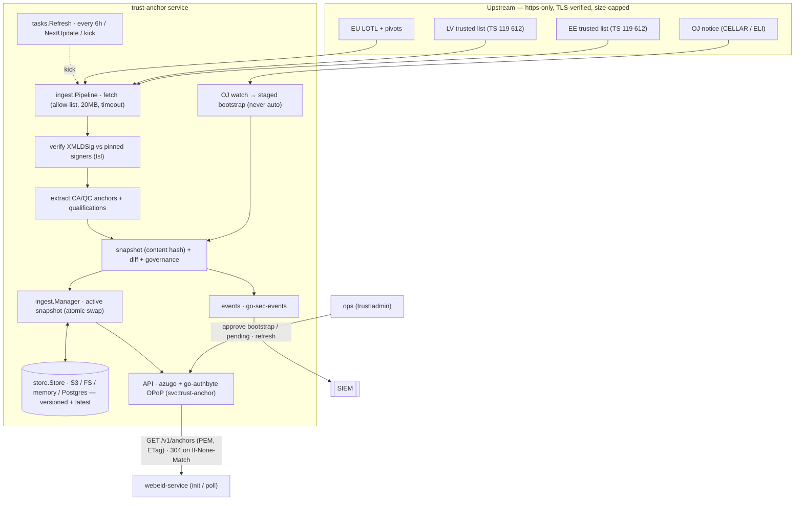

# trust-anchor

EU **LOTL/TL ingester → trusted-CA bundles**. The service automates the
trust-anchor lifecycle for the eSignature Portal:

> LOTL → pivot chain → national trusted lists (ETSI TS 119 612) → filtered
> CA/QC certificates → versioned, cacheable PEM bundles over an authenticated
> API — with every anchor-set change observable as a security event.

First consumer: the **webeid-service** (`WEBEID_TRUSTED_CA_CERTS_PATH`
file contract). Later: go-csc validation, Audit & Evidence, preservation.

---

## Architecture



**Trust model.** Trusted-list signatures are verified against *pinned*
expected signer certificates, never via chain building: the LOTL against the
operator-approved OJEU bootstrap set plus accumulated pivot rotations; each
national TL against the signer certificates carried in its (verified) LOTL
pointer. Only signature-verified bytes are ever parsed for trust decisions.
The one unacceptable failure mode is serving unverified anchors; serving
slightly old data is fine (fail-safe: last good snapshot + security event).

Store backends (`store.Store`): **S3** (platform default), **fs**/**memory**
(dev/test), and **postgres** (dual-mode scaled / multi-DC — set
`TRUST_STORE_DSN`; the `trust_anchor` schema reached via SECURITY DEFINER
procedures, migration in `authbyte-db/trust-anchor/`; see DECISIONS D3/D15 and
`TRUST-INFRASTRUCTURE-EVOLUTION-SPEC.md`).

Package map: [`tsl/`](tsl) TS 119 612 parsing + XMLDSig verification ·
[`trust/`](trust) domain (anchors, snapshots, diff, filters, overlay) ·
[`ingest/`](ingest) fetcher/pipeline/pivots/OJ-watch/manager ·
[`store/`](store) S3 / fs / memory / postgres snapshot stores · [`tasks/`](tasks)
refresh job · [`routes/`](routes) API. XMLDSig verification uses
`lafriks/go-xmldsig/v2`. Key design notes in [DECISIONS.md](DECISIONS.md) —
read D1 (XMLDSig adaptations) and D2 (pivot algorithm) before touching
`tsl/`.

## API

Audience `svc:trust-anchor`; DPoP-bound service tokens (go-authbyte). Scopes:
`trust:read` (bundles), `trust:admin` (governance).

| Method | Path | Scope | Purpose |
|---|---|---|---|
| GET | `/v1/anchors?territory=LV,EE&use=signature&qscdOnly=true` | trust:read | PEM bundle (`application/x-pem-file`). Strong `ETag` = snapshot id, honors `If-None-Match` → 304. Headers `X-Trust-Snapshot`, `X-Trust-Stale` |
| GET | `/v1/anchors.json` (same filters) | trust:read | base64-DER certs + TSP/service metadata, qualifications, fingerprints |
| GET | `/v1/snapshot` | trust:read | snapshot summary + diff vs previous + pending set + staged bootstrap |
| POST | `/v1/pending/{fingerprint}/approve` | trust:admin | approve a held addition (hold mode) |
| POST | `/v1/bootstrap/approve` `{"ojReference":"C/2026/1944"}` | trust:admin | activate the staged OJ bootstrap update (§ runbook) |
| POST | `/v1/refresh` | trust:admin | run an immediate ingestion cycle |
| GET | `/healthz`, `/readyz` | none | readiness = a valid snapshot is loaded |

`use=` ∈ `signature | authentication | seal | website`, mapped from the
`Fore*` qualifiers; a service with no `Fore*` qualifier is included in **all**
uses (TS 119 612 default, task §5). `authentication` is an alias of
`signature` at anchor level (eID authentication certs chain to the same
CA/QC services; see DECISIONS D4). `qscdOnly` maps from `QCWithQSCD` — note
the current LV list carries it only on historical entries (D4).

## Consumer recipe — webeid-service

go-web-eid keeps its file contract (`loadTrustedCAs`: PEM file or dir). The
webeid-service wrapper or an init container does:

```sh
# init: fetch the LV signature anchors into the trust dir
curl -H "Authorization: Bearer $TOKEN" -H "DPoP: $PROOF" \
     -o /etc/webeid/trust/lv-anchors.pem \
     "https://trust-anchor:8080/v1/anchors?territory=LV&use=signature"
# (+ use=authentication separately if a split is wanted — identical today)
export WEBEID_TRUSTED_CA_CERTS_PATH=/etc/webeid/trust/
```

Poll on an interval with `If-None-Match: "<last ETag>"`:

* `304` — nothing to do.
* `200` — write the new bundle, then rebuild the handler / trigger a rolling
  restart (go-web-eid loads the file at startup).
* On errors keep the existing file — the service applies the same fail-safe
  upstream. Treat `X-Trust-Stale: true` as a monitoring signal, not an error.

Demo/test CAs (e.g. `DEMO LV eID ICA 2021/2024`, never present in production
TLs) are deployed to the trust-anchor service via `TRUST_EXTRA_ANCHORS_PATH`
and arrive in the same bundle tagged `source: manual-overlay`.

## Configuration

| Env | Default | Purpose |
|---|---|---|
| `LOTL_URL` | `https://ec.europa.eu/tools/lotl/eu-lotl.xml` | EU List of Trusted Lists |
| `LOTL_BOOTSTRAP_CERTS_PATH` | — | OJEU-published LOTL signer certs (PEM file/dir). **First-install seed only**; afterwards the approved store is authoritative |
| `OJ_PINNED_REFERENCE` | — | OJ notice the seed came from, e.g. `C/2026/1944` |
| `OJ_NOTICE_URL` | — | optional CELLAR/ELI URL override for the OJ watch |
| `TRUST_TERRITORIES` | `LV,EE` | national lists to ingest |
| `TRUST_ACCEPTED_STATUSES` | `granted` | accepted service statuses (names or full URIs) |
| `TRUST_REFRESH_INTERVAL` | `6h` | refresh cadence (earliest TL `NextUpdate` is honored too) |
| `TRUST_ACTIVATION_MODE` | `auto` | `auto` \| `hold` (additions held for approval) |
| `TRUST_HOLD_AUTO_RELEASE` | `72h` | hold-mode auto-release window |
| `TRUST_STALE_GRACE` | `24h` | grace past `NextUpdate` before data is flagged stale |
| `TRUST_EXTRA_ANCHORS_PATH` | — | demo/test overlay (PEM file/dir); empty in production |
| `TRUST_SNAPSHOT_BUCKET/ENDPOINT/ACCESS_KEY/SECRET_KEY/PREFIX/USE_SSL` | — | S3-API snapshot store (platform standard) |
| `TRUST_SNAPSHOT_DIR` | — | filesystem store (development) |
| `TRUST_STORE_DSN` | — | **PostgreSQL backend** — the dual-mode scaled / multi-DC store (spec P1b): the `trust_anchor` schema reached via `SECURITY DEFINER` procedures. **Takes precedence** over S3/FS/memory when set. Schema migration in `authbyte-db/trust-anchor/`; connect as the EXECUTE-only `trust_anchor_svc` role and source the DSN from Vault (it carries a password). |
| `TRUST_FETCH_TIMEOUT` / `MAX_TL_BYTES` | `30s` / `20MiB` | fetch guards |
| `AUTH_ISSUER_URL` / `SERVICE_AUDIENCE` | — / `svc:trust-anchor` | go-authbyte inbound validation (plus standard `DPOP_*` vars) |

Egress: exactly the LOTL host, the TL hosts discovered from the verified
LOTL, and the OJ notice host — https only, TLS verified, size-capped. Any
non-https pointer raises `egress.violation` and the territory falls back to
its last good data.

## Registry additions (authbyte-core/registry.yaml)

```yaml
# audience: svc:trust-anchor
# scopes:   trust:read  — bundle consumers
#           trust:admin — ops tooling only
- client_id: svc:web-eid
  grants:
    - audience: svc:trust-anchor
      scopes: [trust:read]
# later: svc:go-csc (validation), svc:audit-evidence → trust:read
- client_id: svc:ops-tools          # ops/dpo tooling client
  grants:
    - audience: svc:trust-anchor
      scopes: [trust:read, trust:admin]
```

## OJEU bootstrap-certificate procedure

The LOTL signer certificates published in the EU Official Journal are the
root of the whole trust tree. The service fetches updates automatically but
**never activates them automatically** (one poisoned fetch must not swap the
root — DSS's pinned `oj-keystore` is the precedent). Expected frequency:
every few years; pivots rotate signers automatically in between.

**First install**

1. Open the current OJ notice (the LOTL advertises it; today
   `https://eur-lex.europa.eu/eli/C/2026/1944/oj`).
2. Copy the certificates into a PEM file; deploy as
   `LOTL_BOOTSTRAP_CERTS_PATH`, set `OJ_PINNED_REFERENCE=C/2026/1944`.
3. Start the service — it persists the set as bootstrap **v1** and the path
   is ignored from then on.

**When `trust.bootstrap_review_needed` fires** (a new OJ reference was
detected and the notice fetched + staged):

1. `GET /v1/snapshot` → `pendingBootstrap`: OJ reference, subjects, SHA-256
   fingerprints, diff vs the active set.
2. Open the published OJ document **out-of-band** (browser, the official OJ
   PDF) and compare every fingerprint.
3. `POST /v1/bootstrap/approve` with `{"ojReference":"<the reference>"}` —
   one click activates, persists the versioned set, and triggers
   re-verification. A mismatched reference is refused.

If the OJ reference changes but staging does not appear: the automated fetch
failed (eur-lex sits behind a WAF; CELLAR negotiation is environment-dependent
— DECISIONS D5). Set `OJ_NOTICE_URL` to a reachable copy, or in the worst
case rotate via a maintenance redeploy of the seed path with a fresh
`OJ_PINNED_REFERENCE` against an empty bootstrap store.

## Ops runbook

* **`trust.anchor_change` (high)** — a CA was added/removed in a bundle.
  Removals are upstream-authoritative and applied immediately. For additions
  in `hold` mode: review `GET /v1/snapshot` → `pending`, verify the TSP/
  service against the national TL operator's publication, then
  `POST /v1/pending/{fingerprint}/approve`. Unapproved additions auto-release
  after `TRUST_HOLD_AUTO_RELEASE`.
* **`trust.refresh_failure` (warning)** — a cycle failed; the last good
  snapshot is still served. Investigate upstream availability; data ages
  toward staleness, nothing breaks immediately.
* **`trust.stale` / `X-Trust-Stale: true`** — data is past `NextUpdate` +
  grace. Persistent staleness means refresh has been failing: check egress,
  upstream status, and whether the LOTL/TL URLs moved.
* **`egress.violation` (high)** — a TL pointer was non-https or outside the
  allow-list. Possible upstream misconfiguration or tampering; the territory
  keeps serving last good data.
* **Readiness** — `/readyz` is 503 until a snapshot exists (store restore or
  first successful cycle). First install needs working egress.
* **Fixture refresh** (yearly, or when lists change shape): re-record
  `testdata/` — the current LOTL + pivots + LV/EE TLs — and update the
  expected counts/fingerprints in `trust/extract_test.go` and
  `ingest/pipeline_test.go` (sequences asserted in `tsl/verify_test.go`).
  Verify against live first: `go test -tags live ./ingest/ -run TestLiveRefresh -v`.

## Development

```sh
go build ./...
go vet ./...
go test -race -count=1 ./...          # fixtures only — hermetic
go test -tags live ./ingest/ -v       # live network (manual)

# local run without S3:
TRUST_SNAPSHOT_DIR=./.snapshots \
LOTL_BOOTSTRAP_CERTS_PATH=./bootstrap.pem OJ_PINNED_REFERENCE=C/2026/1944 \
AUTH_ISSUER_URL=http://localhost:8080 SERVICE_AUDIENCE=svc:trust-anchor \
go run ./cmd/server web
```

Docker build context is the `sign-portal/` workspace root (local module
replaces): `docker build -f trust-anchor/Dockerfile .`
